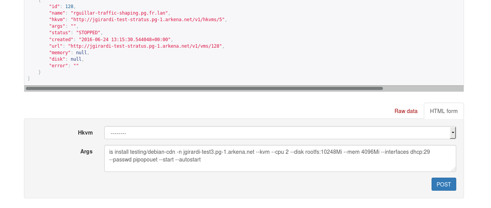
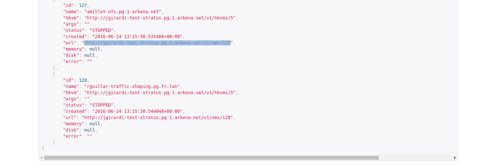
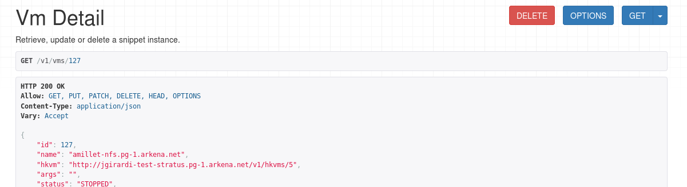

# User guide


Stratus is a tool to help people spawning VM. 

It supplies a web interface as well as an API (and the WebUI is ony the API with some HTML)

There multiple solutions depending of your needs:

- for a one shot VM, you can use the WebUI.
- for a platform that you need to reinstall a few times: use ansible module
- use of the API directly for custom needs (test of autoscaling, plugin for other tool than ansible)


## WebUI

#### Create new VM

Go to [stratus](http://abusi-stratus.pg-1.arkena.net).

Please follow the links to the VM ressources: [{{stratus}}/v1/vms](http://abusi-stratus.pg-1.arkena.net/v1/vms).

In the bottom of the page you can put a vm installation command line in the field `Args`:



Then click on `POST`. Your VM will be provisioned on an hypervisor in a while.

#### Delete a VM

Search for your VM in the listing ([{{stratus}}/v1/vms](http://abusi-stratus.pg-1.arkena.net/v1/vms))

When found click on the `url` field to get the VM details:



You could now delete the VM with the `DELETE` Red Button



You should be asked for a confirmation. As soon as you accept a worker will delete your VM.

Operation is done when VM state is `DELETED`


## Ansible

With the ansible module (shipped in the git of stratus at `contrib/ansible_module/stratus_vm.py`) you can make playbook to manage your VM

#### Create a new VM

```
- hosts: localhost
  gather_facts: False
  tasks:
   - name: "create two VMs"
     stratus_vm:
       vm_list:
        - is install -n {{login}}-vm1.pg-1.arkena.net testing/debian-cdn --mem 4096Mi --disk rootfs:10240Mi --interface dhcp:29
        - is install -n {{login}}-vm1.pg-1.arkena.net testing/debian-cdn --mem 4096Mi --disk rootfs:10240Mi --interface dhcp:29
       state: present
```


#### Delete a VM
```
- hosts: localhost
  gather_facts: False
  tasks:
   - name: "Delete previous VM"
     stratus_vm:
       vm_list:
        - "{{login}}-vm1.pg-1.arkena.net"
        - is install -n {{login}}-vm2.pg-1.arkena.net testing/debian-cdn --mem 4096Mi --disk rootfs:10240Mi --interface dhcp:29
     state: absent
```